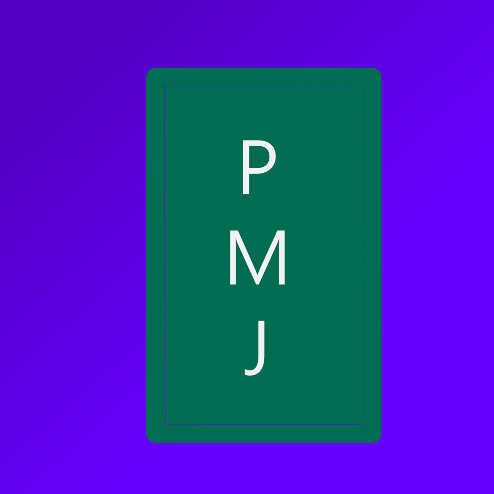

# positive_mahjong



**繁體中文** | [English](READMEs/README_en.md)

**仍在開發中，未完成**

### 特色

使用Rust製作

伺服器使用Iced框架，客戶端使用Slint框架


### 連結

[Github 儲存庫](https://github.com/TW0hank0/positive_mahjong)

[Codeberg 鏡像儲存庫](https://codeberg.org/TW0hank0/positive_mahjong)

[專案文檔](https://tw0hank0.github.io/positive_mahjong)

[KeepAndroidOpen 網站](https://keepandroidopen.org/)

### 檔案結構

見：[專案文檔](https://tw0hank0.github.io/positive_mahjong)

**已過時**

```
project_root
└─ .cargo/ => Cargo設定
└─ .github/
...└─ workflows/ => 工作流(CI)
...└─ ISSUE_TEMPLATE/ => Issue模板
└─ assets/ => 資料
└─ auto_generate/ => 使用腳本產生的檔案
└─ ci/ => 工作流 (workflow - CI)
└─ pmj_client/ => 客戶端 (rust)
...└─ ui/ => Slint UI檔案
...└─ src/ => Rust 客戶端程式碼
└─ pmj_server/ => 伺服器 (rust)
└─ pmj_shared/ => 共用資料
...└─ src/
......└─ shared.rs => 通用資料 (玩法通用資料)
......└─ gamemodes_shared/ => 玩法資料
└─ pmj_test_connection/ => 測試連線
└─ scripts/ => 腳本 (含編譯腳本)
└─ templates/ => 模板
...└─ about_html.hbs => cargo-about的html格式生成模板
...└─ about_json.hbs => cargo-about的json格式生成模板
...└─ about_markdown.hbs => cargo-about的markdown格式生成模板
...└─ addlicense.template => addlicense的檔案Headler模板
└─ secret/ => (**Ignored**) **不能上傳** 的資料
...└─ TW0hank0.keystore => Android用 Keystore
└─ res/ => Android用 assets
└─ LICENSE => AGPL-3.0-only
└─ about.toml => cargo-about 設定
```

### 編譯

見：[專案文檔](https://tw0hank0.github.io/positive_mahjong)

需要rust工具鏈

**電腦**

執行：

```bash
uv run scripts/build_computer.py
```

**Android手機**

需要cargo-apk(`cargo install cargo-apk`)、java、Android sdk+ndk、android-target(`rustup target add aarch64-linux-android`)

執行：

```bash
uv run scripts/build_android.py
```

**WEB-WASM**

目前不支援

### 授權與聲明

版權所有 (C) 2026 TW0hank0

本程式基於 GNU Affero General Public License v3 授權

第三方專案授權見：

- [ThirdPartyLicense-Rust.html](./auto_generated/ThirdPartyLicense-Rust.html)
- [ThirdPartyLicense-Rust.md](./auto_generated/ThirdPartyLicense-Rust.md)
- [ThirdPartyLicense-Rust.json](./auto_generated/ThirdPartyLicense-Rust.json)

**Slint Logo**

本專案使用的 `Slint Logo` 依據 [CC BY-ND 4.0](./assets/CC-BY-ND-4.0.txt) 授權。作者為 [Slint 開發團隊]。本專案未對該 Logo 檔案進行任何修改。

> 檔案路徑：`assets/MadeWithSlint-logo-light.png`

**Material Design 3 component set for Slint**

本專案使用的 `Material Design 3 component set for Slint` 依據 [MIT License](pmj_client/material/LICENSE.md) 授權。作者為 [Slint 開發團隊]。

> 資料夾路徑：`pmj_client/material/`

**Noto Sans TC**

本專案使用的 `Noto Sans TC` 依據 [SIL OPEN FONT LICENSE Version 1.1](assets/Noto_Sans_TC/OFL.txt) 授權。作者為 [Google 與 Adobe]。

> 資料夾路徑：`assets/Noto_Sans_TC/`

**Material Symbols**

本專案使用的 `Material Symbols` 依據 [Apache License Version 2.0](assets/material_symbols/LICENSE) 授權。作者為 [Google]。

> 資料夾路徑：`assets/material_symbols`
