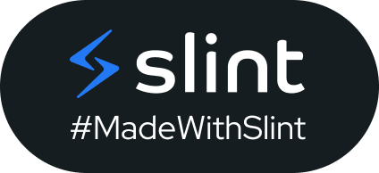

# positive_mahjong

**開發中**

伺服器使用Rust編寫

客戶端GUI使用Slint框架



### 連結

[Github Repo](https://github.com/TW0hank0/positive_mahjong)

[Codeberg Repo](https://codeberg.org/TW0hank0/positive_mahjong)

### 檔案結構

```
project_root
└─ .cargo/ => Cargo設定
└─ .github/workflows/ => 工作流(CI)
└─ android/ => Android手機版客戶端
└─ auto_generate/ => 使用build_script產生的License檔案
└─ ci/ => 工作流(CI)
└─ pmj_client/ => 客戶端 (rust)
...└─ ui/ => Slint UI檔案
...└─ src/ => Rust 客戶端程式碼
└─ pmj_server/ => 伺服器 (rust)
└─ pmj_shared/ => 共用資料
...└─ src/
......└─ shared.rs => 通用資料 (玩法通用資料)
......└─ gamemodes_shared/ => 玩法資料
└─ pmj_test_connection/ => 測試連線
└─ scripts/ => 腳本 (編譯腳本)
└─ TODO.md => 開發計劃
└─ about_html.hbs => cargo-about的html格式生成模板
└─ about_json.hbs => cargo-about的json格式生成模板
└─ addlicense.template => addlicense的檔案Headler模板
```

### 授權

版權所有 (C) 2026 TW0hank0

本程式基於 GNU Affero General Public License v3 授權

第三方專案授權見：

- [ThirdPartyLicense-Rust.html](./auto_generated/ThirdPartyLicense-Rust.html)

"The Slint Logo used in this project is licensed under [CC BY-ND 4.0](./assets/CC-BY-ND-4.0.txt)
. Original work by [Slint Developers/Sixtyfps GmbH]. No modifications have been made to the logo file."
(本專案使用的 Slint Logo 依據 [CC BY-ND 4.0](./assets/CC-BY-ND-4.0.txt) 授權。原始作者為 [Slint 開發團隊]。本專案未對該 Logo 檔案進行任何修改。)
